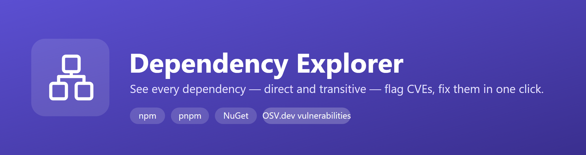
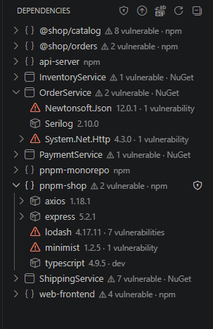

<p align="center">
  
</p>

<p align="center">
  <a href="https://marketplace.visualstudio.com/items?itemName=RuanduPlessis.dependency-explorer"></a>
  <a href="https://marketplace.visualstudio.com/items?itemName=RuanduPlessis.dependency-explorer"></a>
  <a href="https://marketplace.visualstudio.com/items?itemName=RuanduPlessis.dependency-explorer"></a>
  <a href="LICENSE"></a>
</p>

**Your dependency tree, in full — direct *and* transitive — with known CVEs flagged inline and
fixed in one click.** No more `npm ls`, no more guessing which project pulled in that vulnerable
transitive package. Works across npm, pnpm and NuGet, and across every project in your workspace
at once.

<p align="left">
  
</p>

## Why you'll want this

- **See the whole tree, not just `package.json`.** Every project in your workspace — npm, pnpm,
  NuGet, mixed monorepos — shows up as its own node, direct dependencies on top, the full
  transitive graph underneath, expandable as deep as you need.
- **Know *before* you're paged.** Vulnerable packages (via the free [OSV.dev](https://osv.dev)
  database) are flagged red, and anything upstream of one is flagged yellow — so you can see
  exactly which direct dependency dragged in the problem, three levels down.
- **Fix it without leaving the tree.** Update or pin a version and the manifest is edited for you —
  correctly, for your package manager and versioning scheme (npm ranges, pnpm overrides, NuGet CPM).
  Preview the blast radius first; nothing is written until you click Apply.
- **Fix *everything* at once.** One command finds every vulnerable package across a single project,
  a chosen subset, or your entire workspace, and bumps each to the nearest safe version.
- **Or just get current.** A second command bumps *every* package — not only the vulnerable ones —
  to its latest published version, and you can flag the packages you always want on latest so they
  jump there on any upgrade.

## ✨ Features

- 🌳 **Full dependency tree** for npm, **pnpm** (including workspaces) and NuGet — every project in
  the workspace as its own top-level node, monorepos and multi-project solutions fully supported.
- 🛡️ **Vulnerability flags** via [OSV.dev](https://osv.dev): red = this exact version is
  vulnerable (advisory IDs linked in the tooltip); yellow = something deeper in the subtree is.
  Vulnerable projects are badged right in the tree so you know where to look before you even expand
  anything.
- 🔎 **"Why Is This Here?"** — right-click any dependency (direct or transitive) to see every chain
  from your project's direct dependencies down to that package. Shortest chains first (the most
  actionable — update the *first* link to move the package), dev-only chains tagged, and a warning
  when a package resolves to more than one version. Answers "which of my dependencies dragged in
  this transitive package?" without hunting through an expanded tree. Works across npm, pnpm and
  NuGet.
- 🔧 **Fix All Vulnerabilities** — one command, three scopes: a single project, a chosen subset, or
  your whole workspace. Bumps every vulnerable package to the nearest non-vulnerable version:
  direct dependencies are updated, transitive ones are pinned. Re-run it after install to mop up
  anything a resolver needs a second pass on.
- ⬆️ **Update All Packages to Latest** — same three scopes, but for *every* package rather than just
  the vulnerable ones. Each is bumped to its latest published version; anything already current is
  skipped. Direct dependencies start checked in the confirmation list, while transitive pins are
  opt-in (unchecked) — so a routine "update to latest" bumps your directs without pinning the whole
  transitive tree unless you ask it to.
- 🚀 **Bump .NET & Aspire** — upgrade a whole .NET Aspire solution in one pass. Pick a single target
  Aspire version and it's applied to the `Aspire.AppHost.Sdk` **and** every first-party `Aspire.*`
  package across your chosen scope (they ship in lockstep, so they move together), and — optionally,
  in the same flow — bump the .NET `<TargetFramework>` too. Every package, the SDK, and each
  framework edit is shown in a confirmation list before anything is written; an Aspire package the
  feed doesn't publish at the chosen version is left alone and reported. Honors Central Package
  Management and a `<TargetFramework>` centralized in `Directory.Build.props`.
- 🎯 **Bump .NET on its own** — a standalone *Bump .NET Version…* command changes just the
  `<TargetFramework>` across a chosen set of projects, for plain .NET solutions with no Aspire.
- ⭐ **Prefer-latest list** — flag packages that should favour the newest version during the two
  bulk operations (right-click a dependency → *Prefer Latest Version*; the menu toggles to *Remove
  from Prefer-Latest List* once it's flagged — or edit the
  `dependencyExplorer.alwaysLatestPackages` setting, which supports `*` wildcards like `@myorg/*`).
  In **Fix All Vulnerabilities** a flagged package targets its *latest* version instead of the
  smallest safe bump — but only when that latest version is itself non-vulnerable; otherwise it
  quietly falls back to the nearest safe version, so it never lands on a known-vulnerable one. In
  **Update All Packages to Latest** (where everything already targets latest) it simply starts
  *pre-checked* and tagged `★ prefer-latest` — handy for transitive pins, which are otherwise
  opt-in. It has no effect when you update a single package by hand.
- 🚫 **Never-update list** — the opposite of prefer-latest: flag packages to **hold back from both
  bulk operations** (right-click a dependency → *Never Update This Package*; the menu toggles to
  *Remove from Never-Update List* once it's flagged — or edit the
  `dependencyExplorer.neverUpdatePackages` setting, `*` wildcards supported). Held-back packages are
  skipped by **Fix All Vulnerabilities** *and* **Update All Packages to Latest** — even a vulnerable
  one stays put — and are listed afterwards so you know what was left untouched. Updating one by hand
  still works; you'll just get an *update anyway?* confirmation first. If a package is on both lists,
  never-update wins during bulk runs.
- ↑ **Update** a direct dependency or 📌 **override/pin** a transitive one, with the manifest edited
  in place — npm range style preserved, pnpm `overrides`, NuGet `<PackageReference>`/Central
  Package Management all handled automatically.
- 🎯 **Pin or use a range.** After you pick a version, choose how it's written: an exact pin, or a
  range — npm `^` / `~` / `>=`, or NuGet floating (`1.2.*`) and bracket (`[1.2.3]`, `[1.2.3,)`)
  syntax — with a custom-range escape hatch. The dependency preview is computed from the concrete
  version you picked.
- 👀 **Preview before you apply.** Every version change opens a diff of what that version's *own*
  dependencies look like versus your current one — added, removed, changed — pulled live from the
  registry, before anything touches disk.
- 🧭 **Know what an update means before you take it.** Every update prompt is annotated so you can
  decide without leaving the editor:
  - **Semver risk badges** — each bump is tagged `⚠ major` / `minor` / `patch` / `pre-release` in the
    bulk checklists, the version picker, and the preview panel. In **Update All Packages to Latest**,
    major (potentially breaking) bumps start **unchecked** unless the package is on your prefer-latest
    list, so a routine "update everything" never silently opts you into breaking changes.
  - **Deprecation flags** — a version the registry marks deprecated is shown with a `⛔` marker in the
    tree, picker and preview (with the registry's deprecation message). Covers npm's per-version
    `deprecated` field and NuGet's registration `deprecation` metadata.
  - **Changelog / release-notes links** — a dependency's tooltip links to its repository, changelog /
    releases page, homepage and registry page, plus a "latest published" hint with its own risk badge.
    Best-effort and cached; a feed that doesn't expose the metadata simply shows less.
- 🔁 **Bump a shared package everywhere it's used**, in one action — across all projects, a chosen
  few, or just the one you're looking at.
- 🔒 **Private feeds just work.** Version lookups and previews respect your project's own `.npmrc`
  / `NuGet.config` — scoped registries, auth tokens, source mapping — so this works the same way
  behind a corporate proxy as it does on the public registries.
- ⚡ After any edit, the extension offers to run the right install command (`npm install`,
  `pnpm install`, `dotnet restore`) for you, and the tree refreshes itself once it's done.
- ♻️ **Re-install on demand** — right-click a project → *Re-install Dependencies* to run its install
  command, or use the title-bar ♻️ button to re-install every open project at once (npm, pnpm and
  NuGet together, each command run once). Handy for restoring a freshly-cloned NuGet project that
  has no `project.assets.json` yet.

## Getting started

1. Install the extension, then open a folder containing npm, pnpm and/or NuGet projects.
2. Click the **Dependencies** icon in the activity bar. Each project appears collapsed with a
   vulnerability badge if it has one — expand what you want to dig into.
3. Click the 🛡️ **Fix All Vulnerabilities** button in the view title to clean up everything at
   once, or use the ↑ / 📌 icons on an individual package.
4. Working in a .NET Aspire solution? Use the 🚀 **Bump .NET & Aspire Versions…** button (view title,
   or right-click a NuGet project) to move the Aspire SDK, every `Aspire.*` package, and — if you
   like — the target framework in a single reviewed step. For a framework-only change, use **Bump
   .NET Version…**.

## How it reads the tree

| Ecosystem | Source of truth | Requirement |
| --- | --- | --- |
| npm | `package-lock.json` (v2/v3 `packages` map, real node_modules-style resolution) | run `npm install` once (npm 7+) |
| pnpm | `pnpm-lock.yaml` (v6, v9, and the pnpm 11 multi-document layout, including workspaces) | run `pnpm install` once (pnpm 8–11) |
| NuGet | `obj/project.assets.json` (classic + Central Package Management, up to .NET 10 / `net10.0`) | run `dotnet restore` once |

These are the *resolved* graphs, so versions match exactly what your build uses — not what a
semver range merely allows.

## Central Package Management (NuGet)

[Central Package Management](https://learn.microsoft.com/nuget/consume-packages/central-package-management)
(CPM) — where package versions live in a `Directory.Packages.props` file instead of on each
`<PackageReference>` — is fully supported. The extension discovers the nearest
`Directory.Packages.props` by walking up from the project folder and edits the right file
automatically:

| Action | Classic project | CPM project |
| --- | --- | --- |
| **Update** a direct dependency | edits `Version="…"` on the `<PackageReference>` in the `.csproj` | edits the `<PackageVersion>` in `Directory.Packages.props` (or a `VersionOverride` on the reference if one exists) |
| **Override** a transitive dependency | adds a versioned `<PackageReference>` pin to the `.csproj` | adds a `<PackageVersion>` to `Directory.Packages.props`; if [transitive pinning](https://learn.microsoft.com/nuget/consume-packages/central-package-management#transitive-pinning) is **off**, it also adds a versionless `<PackageReference>` to force the pin |

Because a CPM version is shared, updating it fixes every project under that props file at once —
which pairs naturally with "bump across all projects."

## Private and custom feeds

Version lists and preview diffs are resolved through your project's own configuration, not a
hardcoded public registry:

- **npm/pnpm** — reads `.npmrc` (project directory upward to your home directory): the default
  registry, `@scope:registry` overrides, and `_authToken` / `_auth` / `username`+`_password`
  credentials, with `${ENV_VAR}` expansion for tokens.
- **NuGet** — reads `NuGet.config` (project directory upward, plus your user-level config):
  `<packageSources>`, `<disabledPackageSources>`, `<packageSourceCredentials>`, and
  `<packageSourceMapping>`.
- **Azure DevOps & other private feeds** — when a feed needs auth but there are no credentials in
  `NuGet.config` or the environment, the extension asks the Microsoft Artifacts Credential Provider
  (the token store `dotnet` and Visual Studio use), so signed-in Azure DevOps feeds work with no
  extra config. It also reads `ARTIFACTS_CREDENTIALPROVIDER_EXTERNAL_FEED_ENDPOINTS` /
  `VSS_NUGET_EXTERNAL_FEED_ENDPOINTS` (CI), and honors `NUGET_PLUGIN_PATHS` for a custom provider.

No extra setup — if your terminal's `npm install` / `dotnet restore` can already reach a feed, so
can the extension. If an Azure feed reports an authentication error, run `dotnet restore` once to
sign in, then refresh.

## Known limitations

- npm workspaces: packages inside a monorepo without their own `package-lock.json` show a "run npm
  install" hint; open the workspace root (where the lock lives) to see the full graph.
- NuGet multi-targeted projects show the first target framework's graph.
- "Fix All Vulnerabilities" doesn't re-resolve the tree, so a transitive fix is a pin rather than a
  smarter upstream bump — it's safe to re-run after installing.
- Vulnerability severity levels aren't fetched (only advisory IDs, linked to osv.dev); circular
  references are shown once and marked *circular*.

## Contributing

<details>
<summary>Development setup, project layout</summary>

```bash
npm install
npm run compile   # or: npm run watch
```

Press **F5** in VS Code to launch an Extension Development Host, then open any folder containing
an npm, pnpm or .NET project.

To package a `.vsix` for local installation:

```bash
npx @vscode/vsce package
```

then install it via *Extensions: Install from VSIX…*.

### Project layout

- [`src/extension.ts`](src/extension.ts) — activation, tree view registration, file watchers
- [`src/tree/dependencyTree.ts`](src/tree/dependencyTree.ts) — `TreeDataProvider` (lazy expansion, icons, tooltips, bulk-fix helpers)
- [`src/providers/npmProvider.ts`](src/providers/npmProvider.ts) — npm/pnpm provider, adapting both lockfiles to a common resolved graph
- [`src/providers/npmGraph.ts`](src/providers/npmGraph.ts) / [`pnpmGraph.ts`](src/providers/pnpmGraph.ts) — lockfile parsing + resolution for each format
- [`src/providers/nugetProvider.ts`](src/providers/nugetProvider.ts) — `project.assets.json` parsing
- [`src/services/vulnClosure.ts`](src/services/vulnClosure.ts) — cycle-safe "subtree contains a vulnerability" reachability
- [`src/services/osvService.ts`](src/services/osvService.ts) — batched OSV.dev vulnerability queries (cached per session)
- [`src/services/registryService.ts`](src/services/registryService.ts) — version lists, feed-aware
- [`src/services/feedConfig.ts`](src/services/feedConfig.ts) — `.npmrc` / `NuGet.config` parsing and resolution
- [`src/services/metadataService.ts`](src/services/metadataService.ts) — best-effort package metadata (deprecation flags, repository / changelog links), cached per session
- [`src/services/semverRisk.ts`](src/services/semverRisk.ts) — major/minor/patch bump classification for the risk badges
- [`src/services/whyService.ts`](src/services/whyService.ts) — reverse-dependency ("why is this here?") path enumeration over a provider-agnostic graph
- [`src/services/manifestEditor.ts`](src/services/manifestEditor.ts) — pure text edits for `package.json`, `.csproj`, `Directory.Packages.props` (package versions, `<TargetFramework>`, `Aspire.AppHost.Sdk`)
- [`src/services/aspire.ts`](src/services/aspire.ts) — first-party Aspire package detection + target-framework option list
- [`src/services/previewService.ts`](src/services/previewService.ts) — fetches a version's declared dependencies and diffs current vs target
- [`src/services/fixPlanner.ts`](src/services/fixPlanner.ts) — nearest-safe-version resolution for bulk fixes
- [`src/services/packageMatch.ts`](src/services/packageMatch.ts) — case-insensitive, wildcard package-name matching for the prefer-latest list
- [`src/ui/previewPanel.ts`](src/ui/previewPanel.ts) — webview showing the transitive-dependency impact, with Apply / Cancel
- [`src/ui/whyPanel.ts`](src/ui/whyPanel.ts) — webview listing every dependency chain that pulls a package into a project
- [`src/commands.ts`](src/commands.ts) — update/override/bulk-fix commands, .NET & Aspire version bump, preview + confirm, cross-project scope picker, install prompt

</details>

## License

[MIT](LICENSE)
